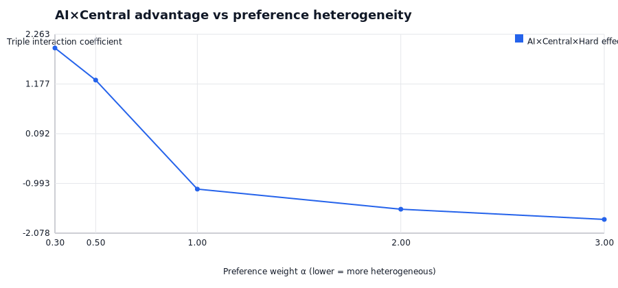

# Can AI make centralized matching worth the investment?
[](https://deepwiki.com/strangeloopcanon/llm-hayek-roth)

**TL;DR**: Yes—in the right conditions. This repo shows that LLM-based intake can unlock a **~28% welfare improvement** when combined with centralized recommendations (18.58 vs 14.13 per customer in hard-to-describe categories). But this isn't universal: it's a *threshold* story where AI intake tips the cost-benefit balance.

📊 Full results: [`reports/paper_latest/README.md`](reports/paper_latest/README.md)

---

## The Key Insight: Preference Heterogeneity

**The more specific people's preferences are, the more AI elicitation matters.**

Think about it:
- If everyone likes everything → any match is fine, elicitation doesn't matter
- If each person has ONE specific thing they want → getting it right is critical

### Empirical proof: preference heterogeneity sweep

We vary **preference concentration** (`weight_alpha`) and measure the AI×Central advantage:

| weight_α | Mean Triple Effect | Interpretation |
|---|---|---|
| 0.3 | **+1.96** | Very concentrated (cares about ONE thing) |
| 0.5 | **+1.26** | Concentrated |
| 1.0 | -1.12 | Moderate (default) |
| 2.0 | -1.56 | Diffuse |
| 3.0 | -1.78 | Very diffuse (cares about everything) |

**Result**: The triple effect flips sign — **positive** for heterogeneous preferences, **negative** for homogeneous ones. This confirms: AI×Central ROI depends on preference specificity.

**Robustness**: Effect persists across:
- AI intake quality: best-case (noise=0.03) vs pessimistic (noise=0.15)
- Misclassification rates: 50% vs 70%



📊 Full robustness analysis: [`reports/heterogeneity_latest/README.md`](reports/heterogeneity_latest/README.md)

This is why "hard" categories (home renovation, custom services) show gains while "easy" categories (lawn mowing) don't.

---

## Why Do Platforms Make You Search?

Because they can't confidently predict what you want. Search is the fallback when preference inference is weak.

**What changes with LLM intake?** Better elicitation → better preference signal → central matching becomes viable in categories where it wasn't before.

**This is a regime shift, not a smooth improvement.** There's a threshold (λ*) where centralized matching suddenly beats search. Better AI intake *lowers* that threshold, meaning central wins in more scenarios.

---

## The 2×2 Experiment

| | Search (you browse) | Central (we match) |
|---|---|---|
| **Standard form** | 14.13 | 14.48 |
| **LLM intake** | 14.27 | **18.58** ← +28% |

*Net welfare per customer (hard category). The magic happens in the LLM × Central cell.*

### Why "Hard" Categories Matter Most

The simulation models two category types:
- **Easy** (e.g., lawn mowing): Simple preferences, standard forms work fine
- **Hard** (e.g., home renovation): Complex multi-dimensional preferences, 70% of standard form submissions mis-specify what the customer actually wants

The AI intake advantage emerges in *hard* categories because that's where:
1. Preferences are more heterogeneous (people want very different things)
2. Standard forms fail to capture the specifics
3. Getting the match right has higher stakes ($1100 value scale vs $500)

### When This Doesn't Work

⚠️ **Congestion kills the gains**: When everyone uses AI-delegated outreach, provider inboxes flood (10+ messages/day), response rates collapse to ~2%, and net welfare *drops* by 0.88 per customer.

⚠️ **Not significant everywhere**: Only 14% of sensitivity runs show p<0.05 for the AI×central×hard effect. The signal is real but noisy.

⚠️ **Easy categories see no benefit**: When preferences are simple and homogeneous, AI intake adds nothing.

---

## Key Metrics

| Metric | What it means |
|---|---|
| **λ** (attention cost) | Cost per search action (messaging, screening, deciding) |
| **λ*** (threshold) | Break-even point where central ties search. *Central wins if λ > λ** |
| **Lower λ*** | Central becomes viable at lower attention costs → wins more often |

**Regime sweep result**: λ* drops from 0.014 → 0.012 as elicitation depth increases, meaning better AI intake expands the "central wins" region.


---

## Results Summary

Net welfare per customer (FieldSim v2, hard):

| intake | search | central | Δ central vs search |
| --- | --- | --- | --- |
| standard | 14.13 | 14.48 | +2.5% |
| LLM | 14.27 | **18.58** | **+30%** |

Headline findings:
- **AI + Central**: 18.58 net welfare (best)
- **Regime shift**: λ* falls from 0.014 to 0.012 with better elicitation
- **Congestion penalty**: -0.88 welfare at 100% AI adoption saturation


<details>
<summary>More plots</summary>


</details>

**Money/prices**

The "realistic" simulation layer (`make field-v2`) includes explicit budgets, quotes, cancellations, and surplus/profit accounting (GPT is used for parsing/elicitation only).

## One-command run

1) Ensure `.env` contains `OPENAI_API_KEY`.
2) Run:

```bash
make setup
make experiment
```

Outputs land in `reports/latest/`:
- `reports/latest/summary_table.csv`
- `reports/latest/summary_table.md`
- `reports/latest/effects_table.csv`
- `reports/latest/effects_table.md`
- `reports/latest/fig_*.svg`
- `reports/latest/run_metadata.json`
- `reports/latest/README.md`

<details>
<summary>Interface Contract commands</summary>

```bash
make check
make test
make llm-live
make all
```

</details>

<details>
<summary>Regime map (k_I × k_J)</summary>

```bash
make regime
```

This sweeps elicitation depth for customers (k_I) and providers (k_J) and plots where
centralized recommendations beat search on net welfare, and the implied ROI boundary (λ*).

- `reports/latest/regime_map_hard_net_welfare_diff.svg`: Central − Search net welfare at the configured `attention_cost`
- `reports/latest/regime_map_hard_lambda_star.svg`: threshold λ* where central starts to win (central wins if `λ > λ*`)
- `reports/latest/regime_grid_hard.csv`: underlying grid (includes `lambda_star`)

</details>

<details>
<summary>Experiment 2: Delegated outreach × congestion (saturation)</summary>

```bash
make congestion
```

Outputs land in `reports/latest_congestion/`:
- `reports/latest_congestion/congestion_saturation_easy.md`
- `reports/latest_congestion/congestion_saturation_hard.md`
- `reports/latest_congestion/fig_*_vs_saturation.svg`
- `reports/latest_congestion/congestion_meta_*.json`

</details>

<details>
<summary>Field-style simulation: cluster randomization + clustered inference</summary>

```bash
make field
```

Outputs land in `reports/field_latest/`:
- `reports/field_latest/arm_summary.md`
- `reports/field_latest/reg_matched.md`
- `reports/field_latest/reg_total_value.md`
- `reports/field_latest/fig_*`
- `reports/field_latest/README.md`

</details>

<details>
<summary>FieldSim v2: dynamics + pricing + cancellations + spillovers + scaling</summary>

```bash
make field-v2
```

Outputs land in `reports/field_v2_latest/`:
- `reports/field_v2_latest/arm_summary.md`
- `reports/field_v2_latest/reg_matched.md`
- `reports/field_v2_latest/spillovers.md`
- `reports/field_v2_latest/fig_*`
- `reports/field_v2_latest/scaling_summary.csv`
- `reports/field_v2_latest/README.md`

</details>

<details>
<summary>Intake verisimilitude samples (home services)</summary>

```bash
make intakes
```

Outputs land in `reports/intakes_latest/`:
- `reports/intakes_latest/intake_samples.json`
- `reports/intakes_latest/README.md`

</details>

<details>
<summary>FieldSim v2 calibration (moment matching)</summary>

```bash
make calibrate
```

Outputs land in `reports/field_v2_calibration_latest/`:
- `reports/field_v2_calibration_latest/best_params.json`
- `reports/field_v2_calibration_latest/best_moments.json`
- `reports/field_v2_calibration_latest/fig_loss.svg`
- `reports/field_v2_calibration_latest/README.md`

To run FieldSim v2 with calibrated params:

```bash
make field-v2-calibrated
```

Outputs land in `reports/field_v2_calibrated_latest/`.

</details>

<details>
<summary>LLM ablations: bits vs parsing vs agent</summary>

```bash
make ablations
```

Outputs land in `reports/ablations_latest/`:
- `reports/ablations_latest/parsing_quality_easy.md`
- `reports/ablations_latest/parsing_quality_hard.md`
- `reports/ablations_latest/ablations_summary_easy.md`
- `reports/ablations_latest/ablations_summary_hard.md`
- `reports/ablations_latest/fig_*`
- `reports/ablations_latest/README.md`

</details>

<details>
<summary>FieldSim v2 sensitivity sweep (seeds × knobs)</summary>

```bash
make field-v2-sensitivity
```

Outputs land in `reports/field_v2_sensitivity_latest/`:
- `reports/field_v2_sensitivity_latest/runs.csv`
- `reports/field_v2_sensitivity_latest/summary.json`
- `reports/field_v2_sensitivity_latest/fig_triple_welfare_vs_rec_k.svg`
- `reports/field_v2_sensitivity_latest/README.md`

</details>

<details>
<summary>Preference heterogeneity sweep (new!)</summary>

```bash
make heterogeneity
```

Sweeps Dirichlet alpha to show AI×Central advantage increases with preference heterogeneity.

Outputs land in `reports/heterogeneity_latest/`:
- `reports/heterogeneity_latest/summary_table.md`
- `reports/heterogeneity_latest/fig_triple_vs_alpha.svg`
- `reports/heterogeneity_latest/README.md`

</details>

<details>
<summary>Paper bundle (single entrypoint table + key figures)</summary>

```bash
make paper-bundle
```

Outputs land in `reports/paper_latest/`:
- `reports/paper_latest/README.md`
- `reports/paper_latest/key_results.md`
- `reports/paper_latest/fig_*.svg`

</details>

---

## For Economists

<details>
<summary>Technical framing & definitions</summary>

Inspired by Peng Shi, "Optimal Matchmaking Strategy in Two-sided Marketplaces" (SSRN 3536086): mechanism choice depends on preference density/inferability and attention/communication costs.

**Operationally:**
- A 2×2: {standard form vs LLM elicitation} × {decentralized search vs centralized recommendations/matching}
- A regime sweep over elicitation depth (`k_I × k_J`) that plots net-welfare differences and the implied break-even boundary `λ*`
- Stress tests: congestion via delegated outreach, field-style cluster randomization + clustered inference

**Definitions:**
- `attention_cost` (λ): per-action cost charged for communication/attention
- `λ*`: break-even λ where central and search tie in net welfare; central wins if `λ > λ*`
- `k_I` / `k_J`: elicitation depth for customers / providers (how much structured preference signal you extract)
- `d_hat`: preference-density proxy (how predictable acceptances are, given inferred preferences)

**Framing:**
- Not "LLMs always improve markets" (effects vary by regime)
- Yes "LLMs can move you across a threshold where central mechanisms become viable," summarized by the regime map ROI boundary `λ*` and the hard-category interaction

</details>

## References

- Peng Shi, "Optimal Matchmaking Strategy in Two-sided Marketplaces" (SSRN 3536086). Optional local PDF (gitignored): `Optimal Matchmaking Strategy in Two-sided Marketplaces.pdf` (see also https://ssrn.com/abstract=3536086).
- Selected related marketplace design evidence referenced in Shi: congestion in matching markets (Roth and co-authors), preference signaling (e.g., Coles et al., Lee & Niederle), and platform experiments on recommendations/search frictions (e.g., Fradkin; Horton; Li & Netessine).
